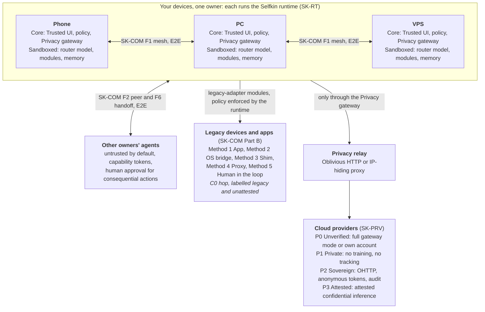

# {{ site.title }}

**{{ site.tagline }}**

**Status: Draft, not for implementation. No certification program exists.**
Conformance profiles are not certifications; before v1.0 any claim of conformance is a self-assessment only. A trademark check for the project name is pending (see [TRADEMARKS.md]({{ site.repo_url }}/blob/main/TRADEMARKS.md)).

A **personal AI** is an advanced AI agent runtime that runs on hardware you own (phone, PC, VPS, home server) and becomes your interface to devices, apps, services, and other agents. These drafts define open, model-agnostic, vendor-neutral standards so that such runtimes are fast, secure, modular, adaptable, and open to everyone. Data, credentials, and memory stay with the user by default.

## Architecture

<figure>

<figcaption>How the three drafts fit together. <a href="{{ site.baseurl }}/assets/architecture.svg">Open the diagram on its own</a>.</figcaption>
</figure>

Diagram source (Mermaid, also rendered in the repository README)

## The Drafts

| Document | Version | Scope |
|---|---|---|
| [Selfkin Runtimes (SK-RT)]({{ site.repo_url }}/blob/main/drafts/runtime-v0.3.md) | Draft v0.3 | The on-device runtime: Core, modules, hardware, Trusted UI, adaptation, memory, Privacy Gateway. Profiles R1 to R3 |
| [Selfkin Edge-to-Edge Communication (SK-COM)]({{ site.repo_url }}/blob/main/drafts/edge-to-edge-communication-v0.1.md) | Draft v0.1 | Identity, pairing, end-to-end encryption, the signed Selfkin Envelope, delegation, legacy compatibility. Profiles C1 to C3 |
| [Selfkin Provider Profiles (SK-PRV)]({{ site.repo_url }}/blob/main/drafts/provider-v0.1.md) | Draft v0.1 | What cloud models and services should offer: anonymous access, no training or retention, no tracking. Profiles P0 to P3, self-assessed only |

Supporting material: [overview and how the drafts fit together]({{ site.repo_url }}#readme), [terminology]({{ site.repo_url }}/blob/main/TERMINOLOGY.md), [threat model]({{ site.repo_url }}/blob/main/THREAT-MODEL.md), [JSON Schemas]({{ site.repo_url }}/tree/main/schemas), [examples]({{ site.repo_url }}/tree/main/examples), [registries]({{ site.repo_url }}/tree/main/registries), [validator]({{ site.repo_url }}/tree/main/tools/validate), [reference implementation]({{ site.reference_url }}) (draft Python, not for production), [open questions]({{ site.repo_url }}/blob/main/schemas/OPEN-QUESTIONS.md), [changelog]({{ site.repo_url }}/blob/main/CHANGELOG.md).

## Take Part

- **Ask or discuss:** [GitHub Discussions]({{ site.repo_url }}/discussions)
- **Report a spec bug or propose a change:** [issues]({{ site.repo_url }}/issues) and the [contributing guide]({{ site.repo_url }}/blob/main/CONTRIBUTING.md) (DCO sign-off, RFC process in [GOVERNANCE.md]({{ site.repo_url }}/blob/main/GOVERNANCE.md))
- **Security or privacy flaw in a spec:** report it privately via [GitHub private vulnerability reporting]({{ site.repo_url }}/security/advisories/new), see [SECURITY.md]({{ site.repo_url }}/blob/main/SECURITY.md)

## Licenses

Specification text: CC BY 4.0. Schemas and code: Apache-2.0. Contributions are covered by an interim royalty-free [patent policy]({{ site.repo_url }}/blob/main/PATENT-POLICY.md) (draft, not legal advice). Project names are not licensed as marks.
